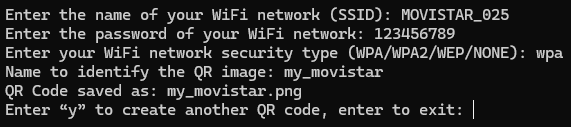

# Instalación de QRCreator

### Linux

Para los usuarios de linux, basta con disponer de Python en su sistema y haber instalado la dependencia de [``qrcode``](https://pypi.org/project/qrcode/).

Esto lo haremos mediante el siguiente comando:

```console
pip install "qrcode[pil]"
```

Una vez hecho esto, ya solo queda ejecutar la aplicación con Python:

```console
python qr.py
```

### Windows

Para los usuarios de Windows, he convertido el código Python en una aplicación `.exe`, la cual ejecuta el script abriendo automáticamente la consola de comandos del sistema y pidiendo todos los datos necesarios para la generación del código QR. Éste, creará la imagen en la misma carpeta en la que ha sido ejecutado, dando seguidamente, la opción de repetir el proceso o de finalizar el programa.



Si tienen instalado Python en su sistema, también pueden descargarse el archivo `.py` y ejecutarlo directamente con el propio Python.

```console
python qr.py
```

### Enlaces de interés

- [pip](https://pip.pypa.io/en/stable/getting-started/)

- [qrcode](https://pypi.org/project/qrcode/)

- [auto-py-to-exe](https://github.com/brentvollebregt/auto-py-to-exe)


